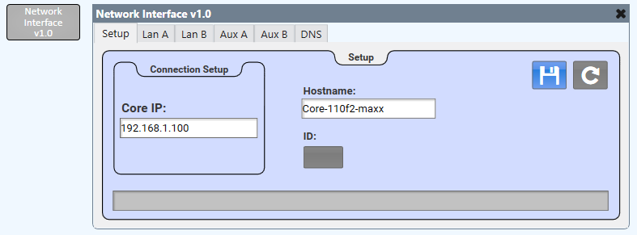

# Q-SYS Network Interface

This is a Q-SYS plugin that allows you to get and set the network settings of any Core on the network. It essentially copies the functionality of the Basic Network interface in Core Manager.

## How to Use

* Simply download the .qplug file and add it to your C:\Users\user\Documents\QSC\Q-Sys Designer\Plugins folder. 
* Drag into your schematic from the plugins section of your Schematic Elements. 
* On the Setup tab, enter a Core's IP address. Once it is entered, the hostname, Lan information for all applicable NICs (MAC address, LLDP info, link speed, IP address, Net Mask, Gateway, and static routes), and DNS info (DNS servers and DNS Search Domains) will all populate on the corresponding pages of the plugin. You can make changes to any of the fields that are not grey and then click the save button to update the configuration.
* You can also add static routes by simply inputting the IP, netmask, and gatway on the corresponding Lan page and click the save button to save these changes to the Core. The same goes for the DNS Servers and DNS Search Domains on the DNS page.
* The refresh button will get all network data from the Core to update the plugin in case any changes were made from Core Manager.

## How it Works

This plugin uses the following Q-SYS extensions to Lua:
* HTTPClient - This is used to get and update network data from and to the Core.
* RapidJSON - This is used to receive and send data as JSON.

All network data is retrieved using HTTP GET and all data is updated using an HTTP PUT. The ID button on the Setup page also uses GET and PUT but using a different endpoint.

## Badges 
 
 

## Questions 
 For any questions, contact me at [maxxsanner105@gmail.com](mailto:maxxsanner105@gmail.com).
#### 

